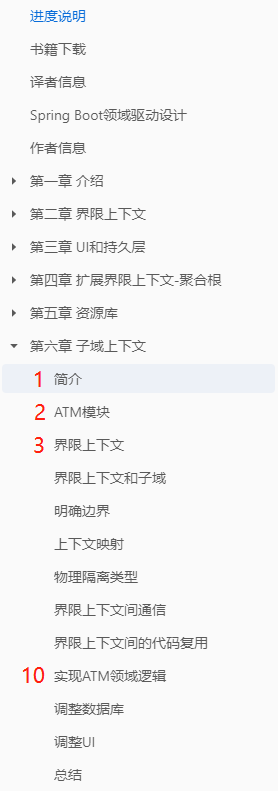
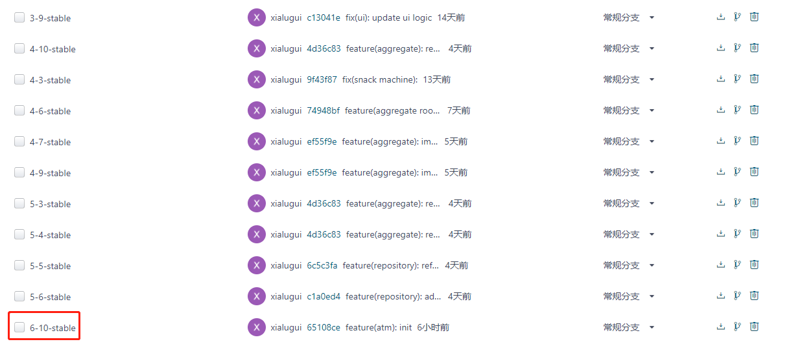
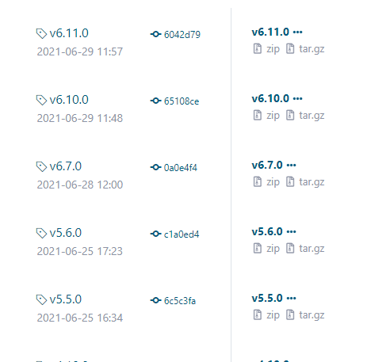

# 领域驱动设计——实践之路
本项目是DDD在Spring Boot下的实践,将DDD概念贯彻于整个项目。从0至1描述领域驱动设计在
Spring boot框架下的应用。
# 食用方式
本项目是书籍《Domain Driven Design with Spring Boot》的源码，此书暂时只有
英文版，本人将其翻译为中文，且将源码重新整理。源码也是我个人学习此书时的实践，为了
帮助广大DDDer，现将源码和书籍翻译分享给大家。
## 中文翻译
大家可在我的语雀中查阅，同时其中也包含英文书籍的下载。[点击跳转](https://www.yuque.com/lugew/ddd)
## 源码和文档对应方式

每章的小节按顺序编号，从1开始。《实现ATM领域逻辑》这一节是第六章的第十小节。
此节的源码对应分支6-10-stable（6代表第六章，10代表第十小节）。

对应分支包含发行版本：

大家可根据学习进度切换分支。
